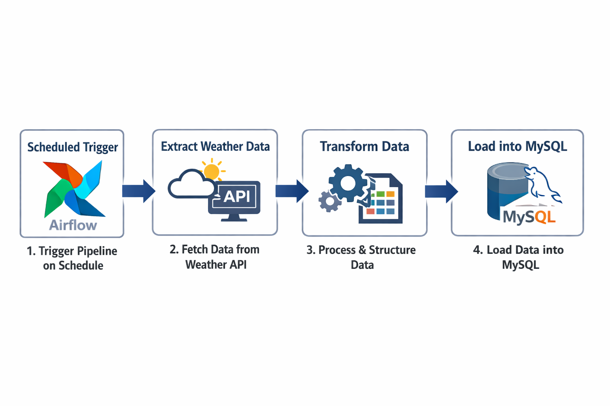
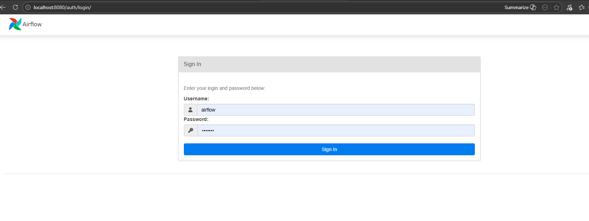
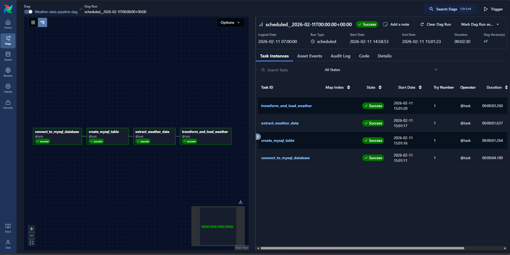
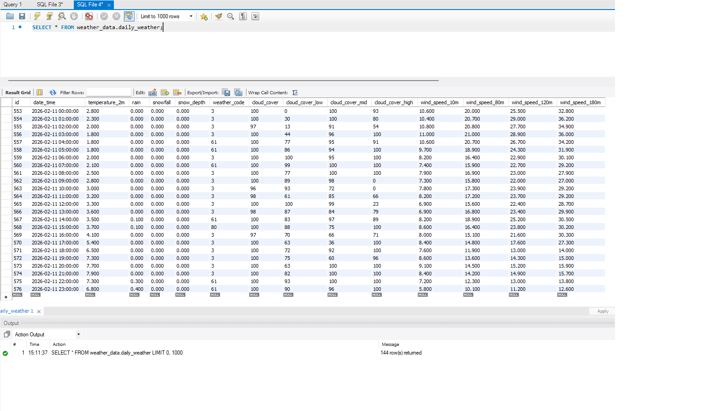

# Weather Data Pipeline with Airflow

## Overview

This project is an end-to-end data pipeline that extracts weather data
from an external API, transforms it, and loads it into a MySQL database.
The pipeline is orchestrated using Apache Airflow and fully containerized
with Docker.

## Data Pipeline Workflow

1. Airflow triggers the pipeline on a scheduled basis.
2. Extract weather data from external API.
3. Transform raw data into structured format.
4. Load data into MySQL database.



## Architecture 

The system is designed around Apache Airflow as the orchestration layer,
running inside Docker containers to provide an isolated and reproducible
execution environment.

All ETL tasks are executed by Airflow workers using Python and Polars for
data processing. The Airflow containers communicate with an external
Weather API to retrieve raw data and connect to a local MySQL database
(outside Docker) to persist the processed results.

This architecture separates orchestration, processing, and storage
concerns while maintaining a simple and production-like local setup.

## Architexture diagram

```txt
                   External System
                 +------------------+
                 |   Weather API    |
                 +------------------+
                           |
                           | HTTP (JSON)
                           v
        +------------------------------------------------+
        |                Docker Container                |
        |                                                |
        |  +------------------------------------------+  |
        |  |          Apache Airflow                  |  |
        |  |                                          |  |
        |  |  - Scheduler                             |  |
        |  |  - Webserver                             |  |
        |  |  - Workers                               |  |
        |  |                                          |  |
        |  |  ETL Tasks:                              |  |
        |  |   1. Extract Weather API                 |  |
        |  |   2. Clean & Transform (Python + Polars) |  |
        |  |   3. Load to MySQL                       |  |
        |  +------------------------------------------+  |
        |                        |                       |
        +------------------------|-----------------------+
                                 |
                                 | TCP Connection
                                 v
                 +----------------------------------+
                 |      Local MySQL Database        |
                 |   (Running outside Docker)       |
                 +----------------------------------+
```

## Tech Stack

### Data Processing
- **Python** – Data extraction and transformation.
- **Polars** – Data cleaning and structured data processing.

### Orchestration
- **Apache Airflow** – DAG-based workflow orchestration and scheduling.

### Storage
- **MySQL** – Relational database for storing processed weather data.

### Infrastructure
- **Docker** – Containerized execution environment.
- **Docker Compose** – Local service orchestration.

## Project Structure

```txt
project-root/
├── dags/
│   └── api_to_mysql_dag.py
├── src/
│   ├── extract/
│   ├── transform/
│   ├── load/
│   └── utils/
├── images/
├── docker-compose.override.yml
├── docker-compose.yml
├── Dockerfile
├── requirements.txt
├── .env.example
└── README.md
```

## How to run project

### 1. run git clone
```bash
git clone https://github.com/Godzillar-mata/Weather-Data-Pipeline.git
```

### 2. Copy .env.example to .env
```bash
cp .env.example .env
```

### 3. setup MySQL database on local with your credential in .env

### 4. run project
```bash
docker compose up -d
```

### 5. Monitor project via Apache Airflow Web-UI service.
```txt
Username: airflow
Password: airflow
```


### 6. Go to dag view.


### 7. Example output.


